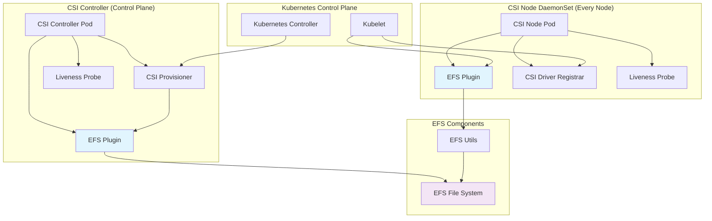
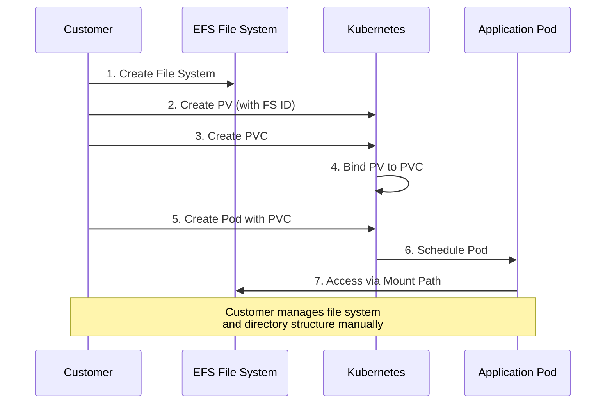
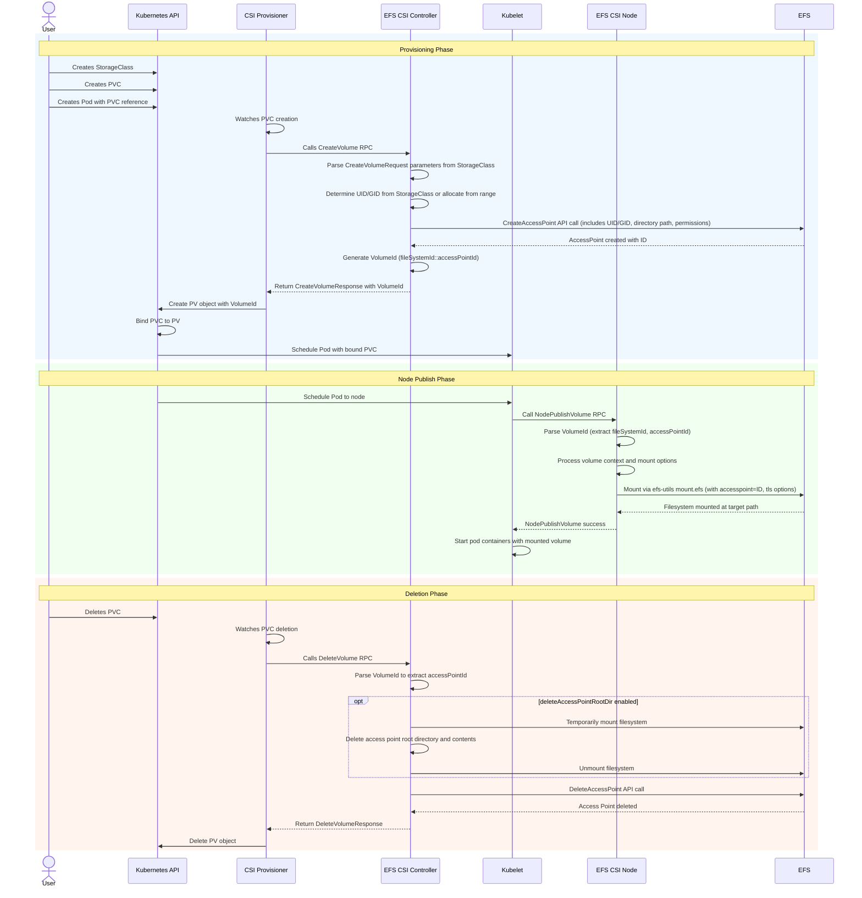

# EFS CSI Driver Design

## Table of Contents

- [Architecture](#architecture)
  - [Controller Service](#controller-service)
  - [Node Service](#node-service)
- [Provisioning Workflows](#provisioning-workflows)
  - [Static Provisioning](#static-provisioning)
  - [Dynamic Provisioning](#dynamic-provisioning)
---

## Architecture

The driver is deployed as two Kubernetes workloads: a **Controller Deployment** and a **Node DaemonSet**. Both share the same binary which registers all three CSI services (Identity, Controller, Node) on a single gRPC server.

### Controller Service

The Controller runs as a Kubernetes **Deployment** (typically 2 replicas with leader election). It handles cluster-wide volume lifecycle operations.

**Containers:**

| Container | Owner | Responsibility |
|---|---|---|
| `efs-plugin` | EFS team | Implements `CreateVolume` / `DeleteVolume` RPCs. Creates and deletes EFS access points via EFS APIs. |
| `csi-provisioner` | kubernetes-csi | Watches PVCs, translates Kubernetes events into CSI Controller RPCs. |
| `liveness-probe` | kubernetes-csi | Exposes health endpoint for Kubernetes liveness checks. |

### Node Service

The Node runs as a **DaemonSet** on every worker node. It handles the actual mount/unmount of EFS file systems into pod containers.

**Containers:**

| Container | Owner | Responsibility |
|---|---|---|
| `efs-plugin` | EFS team | Implements `NodePublishVolume` / `NodeUnpublishVolume`. Invokes efs-utils to mount/unmount. |
| `node-driver-registrar` | kubernetes-csi | Registers the CSI driver with kubelet on the node. |
| `liveness-probe` | kubernetes-csi | Exposes health endpoint for Kubernetes liveness checks. |

All EFS mounts on a given node are managed by a single `efs-csi-node` pod. If a node has 20 application pods, all mount operations and `efs-proxy` processes run within that one pod.

## Provisioning Workflows

### Static Provisioning

The administrator manually creates the EFS file system and Kubernetes PV. The CSI driver is only involved at mount time (Node Service).

### Dynamic Provisioning

The CSI Controller automatically provisions access points as PVCs are created. This workflow involves both Controller and Node services.

